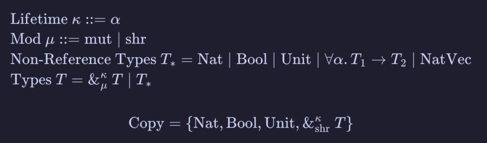

Consider the following C++ code
===

What does this print?

```cpp
int main() {
    std::vector<int> nums = {1, 2, 3};
    int *num = &nums[2];
    nums.push_back(4);
    std::cout << *num << std::endl;
}
```

<!-- pause -->

Answer: oops, undefined behavior!

```bash
❯ g++ test.cpp

❯ ./a.out
-1894668746

❯ ./a.out
-2120099788

❯ ./a.out
1710462087
```

<!-- pause -->

This is a classic example of **use after free**...

<!-- end_slide -->

Now, consider the following Rust code
===

What does this print?

```rust
fn main() {
    let mut nums = vec![1, 2, 3];
    let num = &nums[2];
    nums.push(4);
    println!("{}", *num);
}
```

<!-- pause -->

Answer: compile error :) (how does Rust know to reject this program...?)
```bash
❮ rustc foo.rs
error[E0502]: cannot borrow `nums` as mutable because it is also borrowed as immutable
 --> foo.rs:4:5
  |
3 |     let num = &nums[2];
  |                ---- immutable borrow occurs here
4 |     nums.push(4);
  |     ^^^^^^^^^^^^ mutable borrow occurs here
5 |     println!("{}", *num);
  |                    ---- immutable borrow later used here

error: aborting due to 1 previous error

For more information about this error, try `rustc --explain E0502`.
```

<!-- end_slide -->

Why borrow checking?
===

Manual memory management (like in C) is performant, but very error prone. We use automatic memory management strategies to make programming easier and safer.

<!-- pause -->

# Garbage Collection
- A second procedure whose job is to find unreachable values, and free their memory.
- Different strategies, each with pros and cons (ref cycles, fragmentation).
- Bottom line: we compromise performance for memory safety.

<!-- pause -->

<!-- column_layout: [2, 1] -->

<!-- column: 0 -->

# Borrow Checking (+ ownership)
- A set of rules enforced during compile time that makes certain common memory errors impossible.
    - dangling pointer
    - use after free
    - double free
- With these restrictions, the compiler is able to insert all required calls to malloc/free for you!
- We can ensure our code is memory safe, without the runtime overhead of a garbage collector.
- Sidenote: It can be hard sometimes to convince the compiler your code is safe...

<!-- column: 1 -->

<!-- pause -->


<!-- reset_layout -->

<!-- end_slide -->

History and Motivations
===
# Cyclone
- A research language from the early 2000s that was designed to provide memory safety to C.
- Main goal was to prevent vulnerabilities in C code (buffer overflow, incorrect typecasts, null pointer dereference) by attacking the semantics of the language itself.
<!-- pause -->
- Introduces Regions to C: areas (scopes) where objects live and are deallocated simultaneously.
    - Region subtyping / "outlives" relation.
    - Prevents errors like null pointer dereferencing at compile time.
- A basis for Lifetimes, an important feature of the Rust borrow checker.
<!-- pause -->
- Now a discontinued project, but many of Cyclone's features have been ported over to Rust.
- "Region-Based Memory Management in Cyclone" (Grossman et al. 2002)

<!-- pause -->

# Ownership Types
- Before Rust, ownership types were being studied as another way to enforce safe code.
- Ownership types manage resources (memory) by statically enforcing who can use or modify them.
<!-- pause -->
- Popular in research on safety of concurrent programs.
    - "Ownership Types for Safe Programming: Preventing Data Races and Deadlocks" (Boyapati et al. 2002)
    - "Uniqueness and Reference Immutability for Safe Parallelism" (Gordon et al. 2012)
    - "'Use-Once' Variables and Linear Objects" (Baker 1994)
<!-- pause -->
<!-- newline -->
Today, Rust has the most mainstream and industry-standard implementation of a borrow checker.

<!-- end_slide -->

Borrow checking overview
===

# 1. Ownership

- Substructural type systems

## 2. Borrowing

- Rules on creating **references**, which are statically checked pointers

### 3. Lifetimes

- How we determine which references are valid


<!-- end_slide -->

Ownership
===
# The Ownership Rules (taken from the Rust book)
> - Each value in Rust has an owner.
> - There can only be one owner at a time.
> - When the owner goes out of scope, the value will be dropped.

What is this from a type theoretical perspective?
<!-- pause -->

-> Affine type system: values can be used at most once. This kind of type system is a particular instance of the more general concept of **substructural type systems.**
<!-- end_slide -->


Substructural logic systems
=======
Ordinary logic contains the following three rules:

<!-- pause -->

**Exchange**: The order of two operations doesn't affect the outcome.
```latex +render +width:25%
$A,B\Rightarrow C\equiv B,A\Rightarrow C$
```

<!-- pause -->

**Weakening**: The premise can be extended with additional elements.
```latex +render +width:20%
$A \Rightarrow C \equiv A, B \Rightarrow C$
```

<!-- pause -->
**Contraction**: Equivalent elements on the same side can be contracted into one.
```latex +render +width:20%
$A,A\Rightarrow B\equiv A\Rightarrow B$
```
<!-- pause -->

Substructural logic systems are logic systems which don't permit one or more of these rules. 

**Affine logic** has exchange and weakening, but not contraction.
<!-- end_slide -->

Substructural type systems
===

# Affine type system basics

(Variables)
```latex +render +width:25%
$$\frac{}{\Gamma\text{,}\ x : T \vdash x : T}$$
```

(Lambda)
```latex +render +width:30%
$$\frac{\Gamma\text{,}\ x : T_1 \vdash t : T_2}{\Gamma \vdash \lambda x : T_1. t : T_1 \to T_2}$$
```

(Application)
```latex +render +width:35%
$$\frac{\Gamma_1 \vdash t_1 : T_1 \to T_2 \quad \Gamma_2 \vdash t_2 : T_1}{\Gamma_1\text{,}\ \Gamma_2 \vdash t_1\ t_2 : T_2}$$
```


<!-- end_slide -->

Ownership
===
# Correspondence
- Move semantics: if a value can't be copied (the type doesn't permit copying), it is moved.
- Passing a variable into a function *moves* that variable into that function, and gives it ownership of the variable. This means that function now handles the deallocation of that variable.

```rust
fn main() {
    let nums = vec![1, 2, 3];

    do_something_with_vec(nums);
    do_something_else_with_vec(nums); // <-- error!
}

fn do_something_with_vec(v: Vec<u32>) {}

fn do_something_else_with_vec(v: Vec<u32>) {}
```

<!-- pause -->
But copying every value that we want to use more than once isn't practical. How do we get around this? -> Borrowing.
<!-- end_slide -->

Borrowing
===
- Letting someone else use one of our values by giving a reference. 
    - Key: we still maintain ownership.
- References are by default immutable; the value can be viewed but not changed.
- References can alternatively be created as mutable.

<!-- pause -->

Safety is maintained by permitting references under the following condition.

<!-- pause -->

> At any given time, a value can have either one mutable reference pointing to it, or any amount of immutable references pointing to it, but not both. Additionally, a value can't be mutated while **any** references to it are in scope (except through the mutable reference if one exists).

This ensures: 
- Only one object has the right to mutate a value at a time.
- Objects will not be mutated while they are being read from.

In other words, **no mutable aliasing**.

<!-- end_slide -->

Lifetimes
===

# "How long is this value valid for?"

- Values are freed ("dropped") when their owner goes out of scope.
- Lifetimes ≈ Scopes

When a variable is borrowed, then the reference is tagged with the lifetime of the lender.
- References follow a subtyping relation over lifetimes. `&'a T <: &'b T` if the lifetime `'a` is larger than lifetime `'b` (the scope is larger)

All borrows must end before the lender is dropped. This ensure no dangling pointers!

Examples adapted from Rust by Example
```rust
fn main() {
    let a = 0; // <-- Lifetime of a begins

    let borrow = { // error: variable 'b' does not live long enough
        let b = 0; // <-- lifetime of b begins
        // do something with b
        &b         // <-- lifetime of b ends
    };

    // <-- Lifetime of a ends
}
```

<!-- end_slide -->

Lifetimes (cont.)
===

Subtyping relation
```rust
fn main() {
    let a = 0;              // <-- lifetime of a begins, let's call it '0
    let mut a_ref = &a;     // <-- a_ref has type &'0 int
    { 
        let b = 1;          // <-- lifetime of b begins, let's call it '1
        let mut b_ref = &b; // <-- b_ref has type &'1 int
        a_ref = b_ref;      // error! we can't assign &'1 int to &'0 int because it is smaller
        b_ref = a_ref;      // this works fine
    }
}
```

Functions (polymorphic over lifetimes)
```rust
fn main() {
    let a = 0;
    let my_ref = borrower(&a);
}

fn borrower<'a>(r: &'a u32) -> &'a u32 {
    let b = 0;
    &b // error: variable 'b' does not live long enough 
}
```
The lifetime variable here is some arbitrary lifetime larger than this function.

<!-- end_slide -->


Implementation
===
We implement a borrow checker on a small extension of the simply typed lambda calculus. 

In addition to the usual Unit and function types, we have `Nat` and `Bool` for primitive (copyable) types, and `NatVec`, a vector of Nats, as an example of a more complex data structure. Additionally, we have reference types which are annotated with their lifetime, their mutability, and the type which they are referring to.

Syntactically, we add references (both immutable and mutable), a dereference operator, `let in` expressions, variable assignment, and operations for creating a `NatVec`, as well as pushing, popping, and getting a reference to an element.

# Typechecker
Our typechecker runs in two main phases: the type checker, and the borrow checker.

## Typechecking Pass
- Checks that terms are well-typed.
- Annotates AST nodes with their types.
- Checks the subtype relation of lifetimes.
## Borrow Checking Pass
- Checks that usages are valid.
- Checks the affine type property (no value is used more than once).
- Checks that values can't be moved or mutated while being borrowed.
- Checks that active references obey the mutability rules.

<!-- column_layout: [1, 1] -->

<!-- pause -->

<!-- column: 0 -->

# The syntax of terms
 

<!-- pause -->

<!-- column: 1 -->

## The syntax of types
 

<!-- reset_layout -->

<!-- end_slide -->

Challenges
===
- Closures (capturing?)

- Ending borrows properly (had to attach a variable information to the ref type itself)

- Shadowing (assign each variable a unique id)

- Lifetime polymorphism

- Escaping references

<!-- end_slide -->

Live Demo
===

<!-- end_slide -->

Conclusion and further improvements
===

# Future directions

1. Recursion or some other looping construct for Turing-completeness.

2. Top-level functions (lambdas that can only be called once are not very useful...)

3. Captured borrows in closures

4. Product types for more interesting ownership semantics

## In the literature

- The [RustBelt project](https://plv.mpi-sws.org/rustbelt/) (ended 2021)
    - **RustBelt: securing the foundations of the Rust programming language** (Jung et al. 2018)
        - Models the Rust language with a lambda calculus ("λRust") 
        - A formal treatment of Rust's very advanced type system, including concurrency
        - A less restrictive definition of lifetimes using "lifetime tokens"
        - Proves safety of standard library types such as `Mutex<T>`, `Arc<T>`
    - **RustBelt meets relaxed memory** (Dang et al. 2019)
        - Builds on the previous paper with a memory model that includes atomics and memory ordering.

<!-- end_slide -->

Thanks! (Q&A)
===


<!-- end_slide -->
